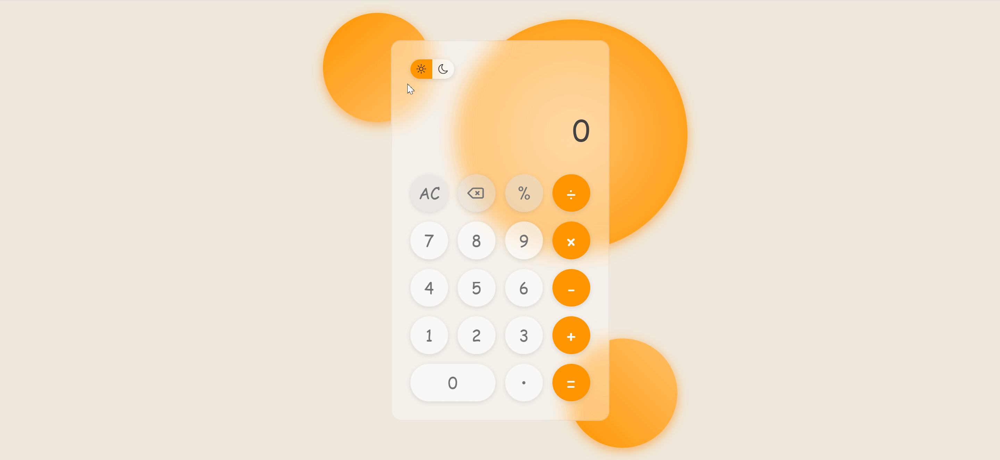

# Calculator

A modern **Calculator** web application with a clean and responsive interface. Users can perform basic arithmetic operations, switch between light and dark themes, and enjoy a smooth, interactive experience.

## Live Demo

🔗 **View Online:**  
https://dorsa-piraneh.github.io/Calculator/

## Screenshots



## Features

- **Basic Arithmetic Operations**: Addition, subtraction, multiplication, division.
- **Percent Calculation**: Supports percentage operations.
- **Backspace / Clear**: Delete the last digit or reset the calculator.
- **Decimal Support**: Handle decimal numbers.
- **Theme Switcher**: Toggle between light and dark themes with persistent selection via LocalStorage.
- **Responsive Design**: Optimized for mobile, tablet, and desktop screens.
- **Formatted Display**: Numbers are formatted with locale separators for readability.

## Installation & Usage

### Option 1: Run Locally (No Git Required)

1. Download the project as ZIP.
2. Extract the files.
3. Open `index.html` in your browser.

### Option 2: Clone with Git

```bash
git clone https://github.com/dorsa-piraneh/Calculator.git
```

Then open `index.html` in your browser.

## Project Structure

```txt
Calculator/
│   index.html
│   README.md
│
├───assets
│   ├───fonts
│   │   └───Poppins/
│   │
│   ├───icons
│   │   └───FontAwesome/
│   │
│   └───images
│            demo.gif
├───css
│       main.css
│
└───js
        main.js
```

## Technologies Used

- HTML5
- CSS3 / CSS Variables
- JavaScript (ES6+)
- FontAwesome Icons
- LocalStorage API

## Future Improvements

- **Keyboard Support**: Allow input using keyboard keys.

## Author

**Dorsa Piraneh**  
GitHub: [https://github.com/dorsa-piraneh](https://github.com/dorsa-piraneh)
